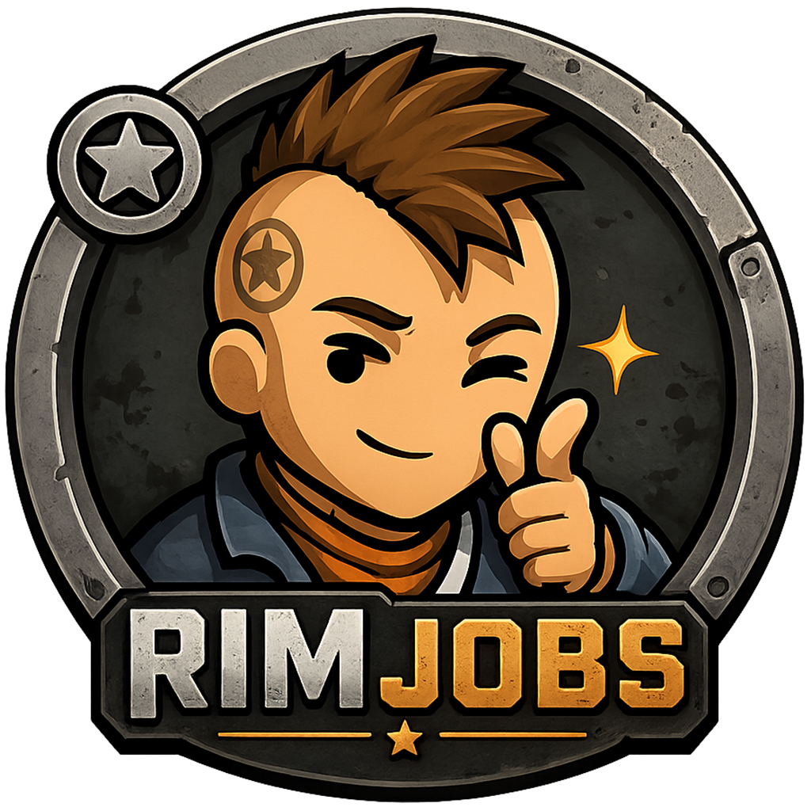
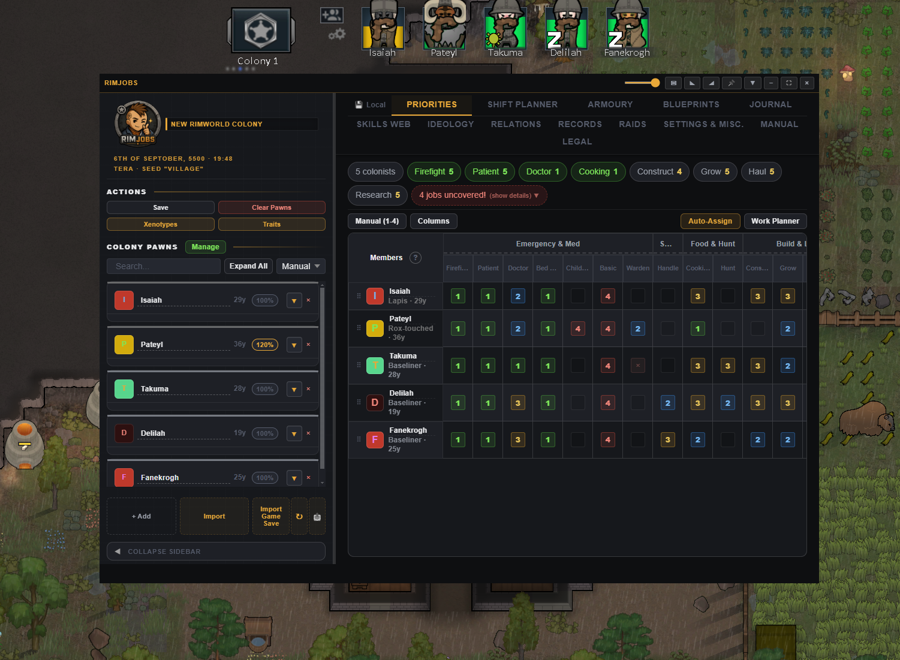
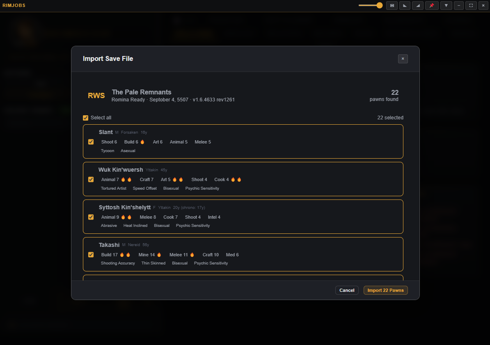
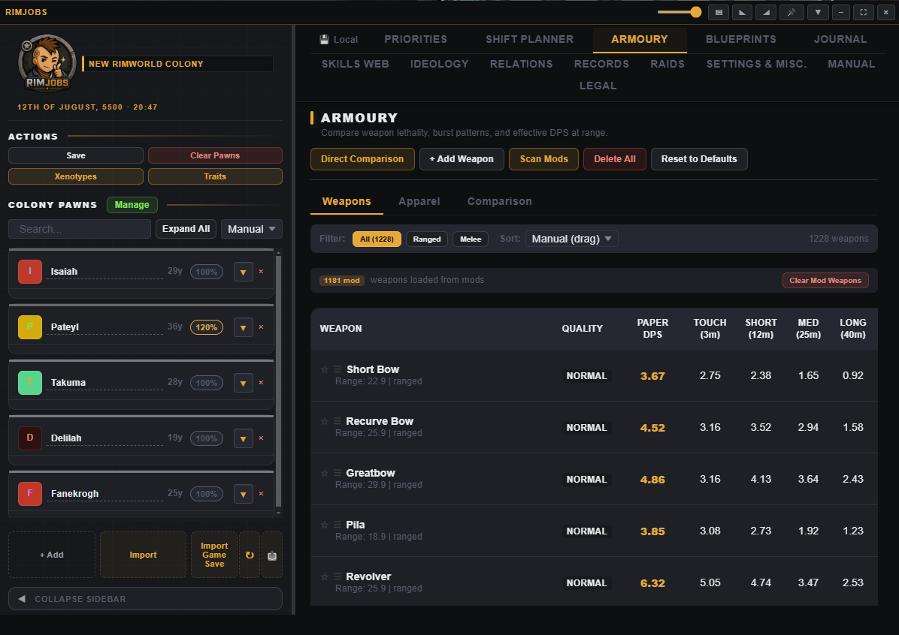
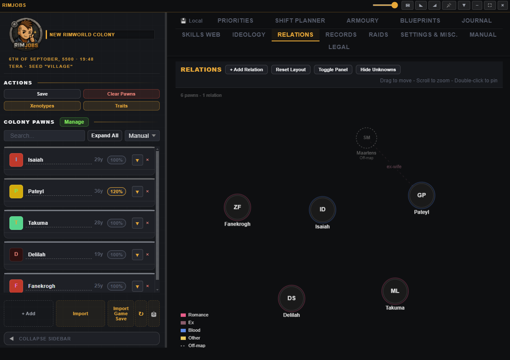
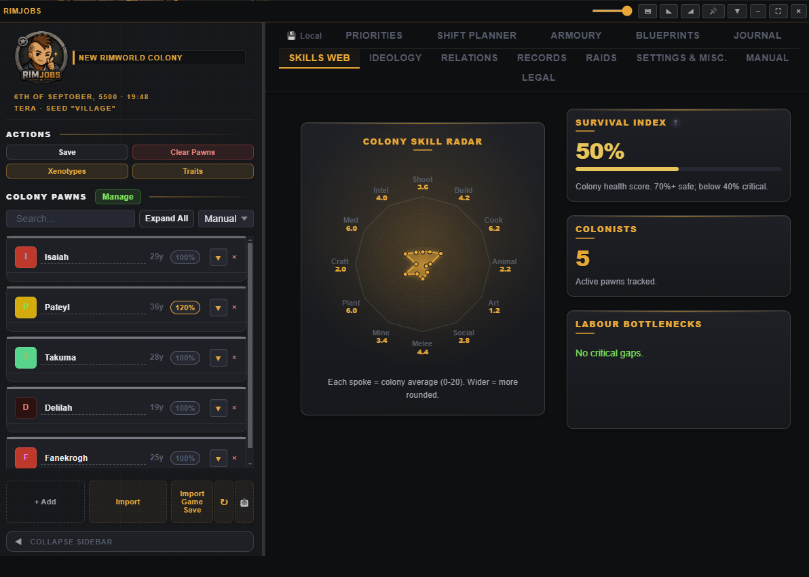
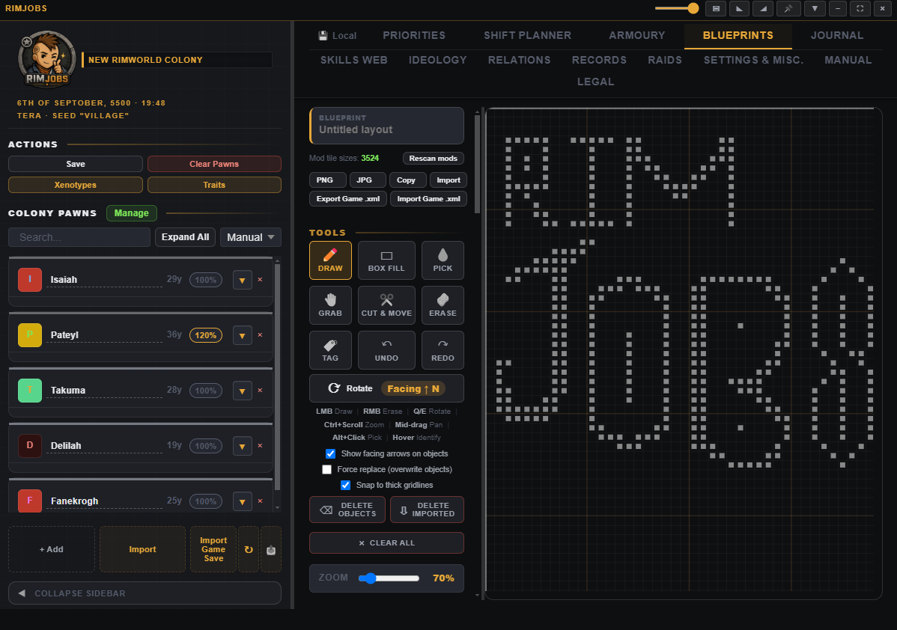

<div align="center">



# RimJobs

**Tongue-in-cheek colony management.**

Get your mind and colony out of the gutter. Import your real `.rws` save and get your whole colony, skills, gear, relationships and base plans in one always-on-top overlay, side by side with the game.


[](https://ko-fi.com/rimjobs)



</div>

> **Fan project disclaimer.** RimJobs is an unofficial, fan-made tool. It is **not affiliated with, endorsed by, or associated with Ludeon Studios** or RimWorld. "RimWorld" is a trademark of Ludeon Studios.

---

## Contents

- [What is it?](#what-is-it)
- [Screenshots](#screenshots)
- [Features](#features)
- [Future plans (maybe)](#future-plans-maybe)
- [Install](#install)
- [Is it safe?](#is-it-safe)
- [Build from source](#build-from-source)
- [Feedback and bugs](#feedback-and-bugs)
- [Support](#support)
- [Acknowledgements](#acknowledgements)
- [License](#license)

## What is it?

RimJobs is an always-on-top overlay (or a normal window) that helps you **plan and analyse your colony** without alt-tabbing into spreadsheets. Import a real `.rws` save to pull in your colonists, skills, traits, health, relationships and records, then tinker with the numbers, compare gear, design your base, plan your ideology, and even **edit colonists and write the changes back to a save you can load in-game**.

It started life as a way to *clearly and easily compare weapons and armour* (a 1200+ mod list adds a fair few), then I thought of the name, committed to the bit, and here we are...

## Screenshots

<div align="center">
<table>
<tr>
<td width="50%" align="center"><br><strong>Pull your actual colony straight from a <code>.rws</code> save</strong></td>
<td width="50%" align="center"><br><strong>Settle which gun or armour is better with a real verdict</strong></td>
</tr>
<tr>
<td width="50%" align="center"><br><strong>Map the whole web of bonds, rivalries and family across your colony</strong></td>
<td width="50%" align="center"><br><strong>Spot skill gaps and missing critical workers at a glance</strong></td>
</tr>
<tr>
<td colspan="2" align="center"><br><strong>Plan your base, furniture footprints and all</strong></td>
</tr>
</table>
</div>

## Features

- **Import your real colony:** read a RimWorld `.rws` save (colonists, skills, traits, health, relations, ideology, lifetime records) and auto-create any unknown modded content so nothing is lost.
- **Offline mod scanning (the rabbit hole):** point it at your mods folder and it reads them entirely offline to pull in custom traits, passions, injuries and conditions, ideology memes and rituals, and weapon and armour stats, so even a 1200+ mod list is understood without a single online lookup. This part turned into a proper rabbit hole.
- **Edit colonists and write back to your save:** change skill levels and passions (including modded passions from frameworks like Alpha Skills and Vanilla Skills Expanded, picked by name and preserved losslessly), add or remove any vanilla or modded trait (conflict-aware, no trait cap), add or remove injuries and conditions (with Heal all and Remove scars), edit relationships between colonists, and set ideology certainty. Then export a new `.rws` you can load straight back into RimWorld. It edits a fresh copy and never touches your original, and only the values you change are written, so the rest of the save is left exactly as it was.
- **Work priorities and optimiser:** a full priority grid with click, scroll and keyboard editing, and an optimiser that flags gaps, single-points-of-failure and weak assignments.
  - Configurable 1-4 to 1-9 priority range with green-to-red colour scaling.
  - Auto-assigner that guarantees job coverage across the selected range.
  - Colony Focus choices (construction, farming, mining, etc.) to bias assignments towards a strategic goal.
- **Armoury:** compare weapons, apparel and full kits side by side with a verdict, with DPS, range accuracy, armour-penetration and quality maths checked against RimWorld's own decompiled source rather than guessed at (the feature that started it all).
- **Blueprints:** a grid layout designer with multi-cell furniture, correct footprints and facing, collision and force-replace, grab-and-move, reusable stamps, and Blueprints-mod XML import and export.
- **Relations:** an interactive, force-directed social graph with romance compatibility, fight-risk and opinion estimates, including off-map and deceased relatives.
- **Skills Web:** a dashboard with your colony's survival index, an interactive skill radar, and a list of labour bottlenecks.

- **Accessibility:** a colour-blind friendly palette (blue-orange, with dash patterns on the relation graph so edges are distinguishable without colour alone) and an optional dyslexia-friendly font (OpenDyslexic), both independent of theme.

Plus a **shift planner**, **ideology planner**, **raid-points calculator**, **journal and timeline**, and **records** browser, all documented in the in-app **Manual** tab.

## Future plans (maybe)

- **Other operating systems.** RimJobs is Windows only for now. Getting it running on macOS and Linux is the big one.
- **Colony and base viewer.** Render your colony's actual structures, walls, rooms and furniture, straight from the save. The terrain itself cannot be rebuilt offline, but the buildings can.
- **Live save sync.** Watch the save file and refresh the overlay as you play, instead of re-importing each time.
- **Wider mod coverage.** Keep broadening the offline parser as people report modded weapons, traits or conditions it reads oddly.
- **Custom themes.** Recolour the overlay and accents to taste.
- **Translations.** Support for other languages so the app is not English-only.
- **In-game bridge mod.** A companion RimWorld mod that lets you push data like work priorities and shift schedules straight from the app into the running game, instead of going through a save file.
- **Update checker.** A quiet nudge when a new version is out, since it is a portable exe with no auto-update.

## Install

1. Download the latest **`RimJobs.exe`** (portable, no installer) from the [Releases](https://github.com/fugnsig/RimJobs/releases/latest) page.
2. Run it. Windows is the only supported platform.

## Is it safe?

Short answer: yes, and you can verify every line yourself.

- **It is fully offline.** Everything is stored locally on your machine. RimJobs never touches the network, has no telemetry, and never sees your data.
- **Open source.** The entire app is in this repo. If you would rather not trust a binary from a stranger, [build it yourself](#build-from-source).
- **"Windows protected your PC"?** That is expected. RimJobs is not code-signed, so Microsoft SmartScreen flags it on first run. Code-signing certificates cost hundreds of dollars a year, and this is a free hobby project, so paying for one isn't on the cards. Click **More info**, then **Run anyway**, and scan it with whatever you like.
- **Why administrator?** Only so it can capture its overlay hotkeys (like `F12`) while RimWorld holds keyboard focus. I think windowed RimWorld works around that, too.
- **Crash resilience.** If the app hits a graphics driver issue or runs low on memory, it detects the problem and automatically switches to a safe rendering mode on the next launch so you are not stuck.

## Build from source

Requires [Node.js](https://nodejs.org/) (18+).

```bash
npm install
npm start          # run in dev
npm run build      # produce a portable RimJobs.exe
```

Built with Electron and a vanilla-JS renderer (no framework), [koffi](https://koffi.dev/) for the native Windows keyboard hook, and packaged with electron-builder.

<details>
<summary><strong>Releasing (maintainers)</strong></summary>

<br>

The built `.exe` is not committed, it is published as a GitHub Release asset by CI. To cut a release, bump the version in `package.json`, then push a matching tag:

```bash
git tag v1.3.37
git push origin v1.3.37
```

The [`Release` workflow](.github/workflows/release.yml) builds the portable `RimJobs.exe` on a Windows runner and attaches it to a new GitHub Release with auto-generated notes.

</details>

## Feedback and bugs

Found a bug or have an idea? Please open an **[issue](https://github.com/fugnsig/RimJobs/issues)**. Mod-data quirks (modded weapon, armour or footprint readings) are especially helpful to report.

## Support

RimJobs is free and always will be. If it saved you some hassle and you would like to chip in, you can **[buy me a Ko-fi](https://ko-fi.com/rimjobs)** ☕. It took a fair while to put together, I'm not a token billionaire on any fancy AI plan, so it did come along day by day, planning what to try, jotting ideas down and crossing off the ones that went nowhere. Donations are always appreciated and never required or expected, and they don't unlock anything extra. It is and will remain a fan project.

## Acknowledgements

- Game data is sourced from RimWorld's game files and the **[RimWorld Wiki](https://rimworldwiki.com)**.
- **[RimSearcher](https://github.com/kearril/RimSearcher)** by kearril (MIT), a tool for fast searching of RimWorld's source code. The game-accurate combat, armour-penetration and raid maths in RimJobs were verified against RimWorld's decompiled source with it.
- Blueprint sharing is an offline take on the in-game **[Blueprints](https://steamcommunity.com/sharedfiles/filedetails/?id=708455313)** mod by **[Fluffy](https://steamcommunity.com/id/FluffyMods)**, whose work inspired the feature.
- The optional **OpenDyslexic** typeface is copyright © 2019 Abbie Gonzalez and is distributed under the SIL Open Font License 1.1. OpenDyslexic is a Reserved Font Name.
- Shoutouts to ferny and **[The Progression Modpack](https://steamcommunity.com/sharedfiles/filedetails/?id=3521297585)**, an inspiration for this project.

RimJobs is a fan project and is not affiliated with, endorsed by, or associated with any of the mods, projects or people credited above.

## License

[MIT](LICENSE) © Brodie Zotti

---

<div align="center"><sub>Made for fun. I hope <em>someone</em> finds it useful. Time to rim.</sub></div>
